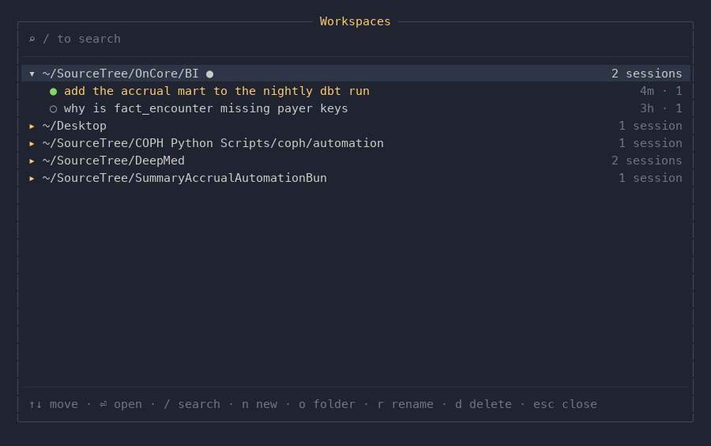
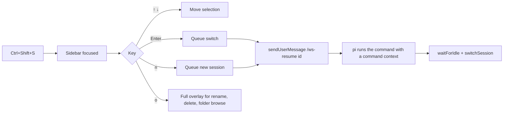

# pi-workspace-sidebar

A persistent sidebar for the [pi coding agent](https://pi.dev) that docks into
the right-hand columns of the terminal, lists every workspace pi knows about and
the sessions inside them, and lets you switch, create, rename, and delete
sessions without leaving the keyboard.

```
┌────────────────────────────────────────────────────────────────────────────────────────────┐
│ pi ayu-mirage                                               │ WORKSPACES                     ● │
│                                                             │──────────────────────────────────│
│ ▌ why is fact_encounter missing payer keys?                 │ ▾ ~/SourceTree/OnCore/BI ●   (2) │
│                                                             │   ● add the accrual mar…  4m · 1 │
│ Let me check the mart and the seed it joins to.             │   ○ why is fact_encount…  3h · 1 │
│                                                             │ ▸ ~/Desktop                  (1) │
│ ⏺ read models/marts/fact_encounter.sql                      │ ▸ ~/SourceTree/COPH Python…  (1) │
│   42  left join payer_dim p on p.payer_id = e.payer_id      │ ▸ ~/SourceTree/DeepMed       (2) │
│   43  -- p.payer_key is null for legacy rows                │ ▸ ~/SourceTree/SummaryAccr…  (1) │
│                                                             │                                  │
│ The join uses payer_id but the dimension is keyed on        │                                  │
│ payer_key, so legacy rows drop out of the mart.             │                                  │
│                                                             │                                  │
│ 3 files changed · +48 −12                                   │                                  │
│                                                             │                                  │
│ >                                                           │ ↑↓ · ⏎ · n · o · esc             │
└────────────────────────────────────────────────────────────────────────────────────────────┘
```


The same list is also available as a full-screen overlay for narrow terminals
and for the actions a one-line-per-row list cannot host:

| Overlay (`/ws`) | Folder browser (`o`) | Rename (`r`) | Search (`/`) |
| --- | --- | --- | --- |
|  |  |  |  |

## What it does

- **One list for everything.** Every workspace pi has a session for, grouped by
  working directory, newest first, with the current one on top and its sessions
  expanded.
- **Switch sessions** with `Enter` — no session id to type, no file to open, no
  second keystroke.
- **Start a session** in the selected workspace (`n`) or in any folder on disk
  through a small folder browser (`o`).
- **Rename** (`r`) and **delete** (`d`) sessions in place. Deletes go to the
  macOS trash when the `trash` CLI is available, otherwise the file is removed.
- **Search** (`/`) filters workspaces and sessions as you type.
- **Read-only where it counts.** Nothing is written until you act: creating a
  session writes a one-line session file, and if pi cancels the switch that file
  is removed again.

## Install

```sh
pi install npm:pi-workspace-sidebar
```

or straight from git:

```sh
pi install git:github.com/Gendyyy/pi-workspace-sidebar
```

Requires pi with extension support (the `@earendil-works/*` packages are
`peerDependencies`, so nothing is bundled) and Node 22+.

## Use

| Command | What it does |
| --- | --- |
| `/ws` | Open the full overlay |
| `/ws <filter>` | Open it pre-filtered, e.g. `/ws deepmed` |
| `/ws-sidebar` | Show the sidebar status |
| `/ws-sidebar on` / `off` / `toggle` | Show or hide the docked sidebar |
| `/ws-sidebar width <20-120>` / `auto` | Pin the width, or go back to automatic |
| `/ws-resume <id>` | Apply a selection queued by a keypress |

`Ctrl+Shift+S` focuses the sidebar so it owns the keyboard; pressing it again
(or `Esc`) hands the keyboard back to the editor. Rebind it in
`~/.pi/agent/keybindings.json` if it collides with something else.

### Keys

**Docked sidebar** — only while focused with `Ctrl+Shift+S`:

| Key | Action |
| --- | --- |
| `↑` `↓` / `PgUp` `PgDn` | Move |
| `Enter` | Open the workspace, or switch to the session |
| `n` | New session in the selected workspace |
| `o` / `/` | Open the full overlay |
| `Esc` | Back to the editor |

While the sidebar is unfocused every keystroke goes to the editor untouched.

**Overlay session list**

| Key | Action |
| --- | --- |
| `↑` `↓` / `PgUp` `PgDn` / `Ctrl+P` `Ctrl+N` | Move |
| `Enter` | Open the workspace, or switch to the session |
| `Tab` / `←` | Collapse the workspace |
| `→` / `Ctrl+L` | Expand the workspace |
| `/` | Search (then any printable key filters, `Esc` leaves search) |
| `Backspace` / `Ctrl+U` | Edit / clear the filter |
| `n` | New session in the selected workspace |
| `o` | Browse for a folder to start a session in |
| `r` | Rename the selected session |
| `d` | Delete the selected session |
| `q` / `Esc` | Close |

**Folder browser**

| Key | Action |
| --- | --- |
| `↑` `↓` | Move |
| `Enter` | Open the highlighted folder, or start a session here |
| `Tab` | Start a session in the current folder |
| `Esc` | Back to the list |

**Rename** — `Enter` saves, `Esc` cancels, `Ctrl+U` clears.
**Delete** — asks for confirmation; `y` deletes, `n` cancels.

## How the sidebar is drawn

pi's extension API can only place widgets *above* or *below* the editor, so a
side panel has to be composited by the extension itself. `dock.ts` narrows the
terminal's `columns` with a getter override — pi then renders the whole
conversation into the left-hand columns — and paints the sidebar into the
remaining columns after every render, inside a synchronized-output frame.

Two details matter for not corrupting the screen: pi's full-line erase
(`ESC[2K`) is rewritten to `ESC[nX`, which stops at the sidebar instead of
wiping it, and each row is diffed against the previous frame so an unchanged
sidebar writes nothing at all.

Selection is a separate concern from painting. pi only exposes
`switchSession()` / `newSession()` to *command* contexts, not to shortcut or
raw-input contexts, so the sidebar resolves a row to an action and then
dispatches `/ws-resume <id>` through `sendUserMessage(..., { expandPromptTemplates: true })`.
pi executes that command with a real command context, which is what makes a
switch a single keypress.



On a terminal narrower than 80 columns the sidebar hides itself and
`Ctrl+Shift+S` opens the overlay instead. Set `PI_SIDEBAR_BG="#rrggbb"` to give
the sidebar an opaque background.

## Development

```sh
npm install
npm run check     # tsc --noEmit
npm test          # node:test via tsx
npm run screenshot  # regenerate assets/*.png
```

The suite is hermetic: it builds its own temp sessions root and passes it as
`sessionDir`, so it never reads or writes your real `~/.pi/agent/sessions` tree.

```
extensions/workspaces/data.ts     session/workspace model, rename, delete, folder listing
extensions/workspaces/sidebar.ts  pure renderer for the docked list
extensions/workspaces/dock.ts     terminal compositor that reserves the right-hand columns
extensions/workspaces/panel.ts    the overlay TUI component and its key handling
extensions/workspaces/index.ts    /ws, /ws-resume, /ws-sidebar, Ctrl+Shift+S
```

## License

MIT
