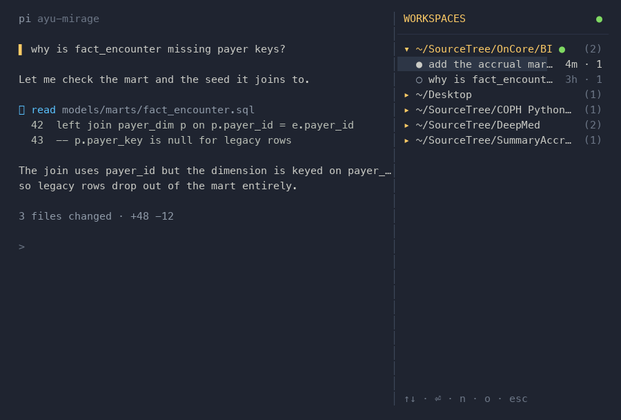
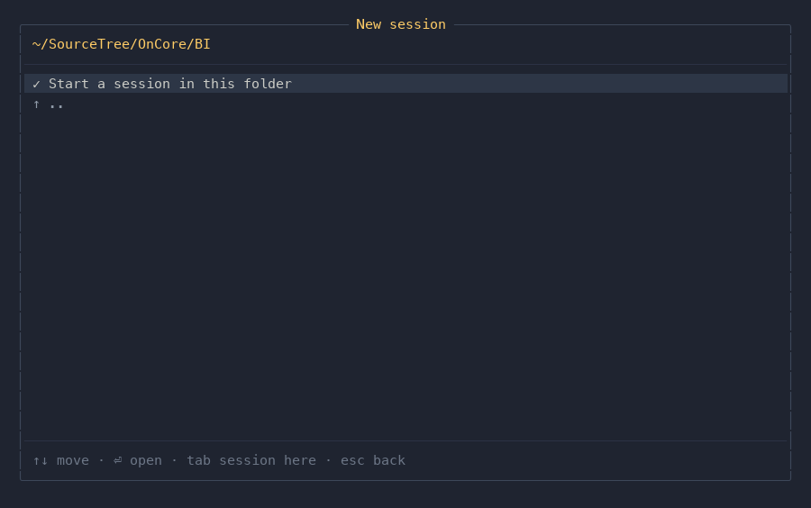
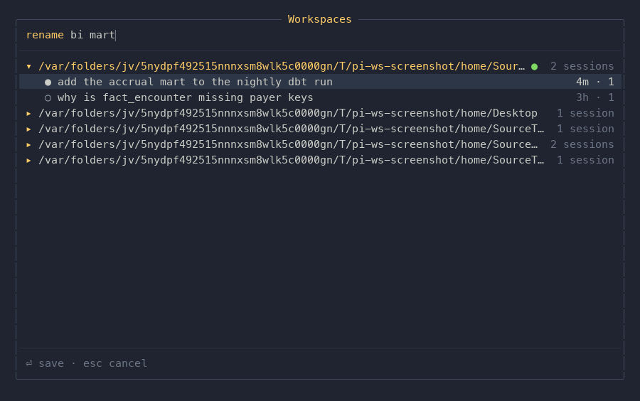
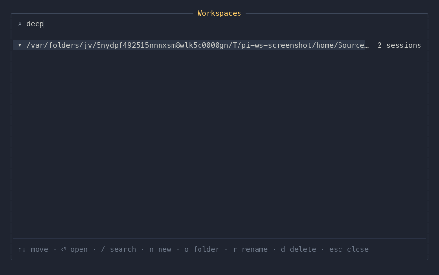
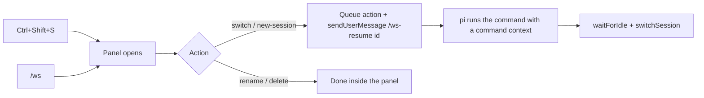

# pi-workspace-sidebar

A workspaces panel for the [pi coding agent](https://pi.dev) that lists every
workspace it knows about and the sessions inside them, and lets you switch,
create, rename, and delete sessions without leaving the keyboard.
`Ctrl+Shift+S` toggles it as a centered overlay.

```
╭────────────────────────────────── Workspaces ──────────────────────────────────╮
│ ⌕ / to search                                                                  │
│────────────────────────────────────────────────────────────────────────────────│
│ ▾ ~/SourceTree/OnCore/BI ●                                          2 sessions │
│    ● add the accrual mart to the nightly dbt run                      5m · 1   │
│    ○ why is fact_encounter missing payer keys                         3h · 1   │
│ ▸ ~/Desktop                                                          1 session │
│ ▸ ~/SourceTree/DeepMed                                              2 sessions │
│────────────────────────────────────────────────────────────────────────────────│
│ ↑↓ move · ⏎ open · / search · n new · o folder · r rename · d delete · esc      │
╰────────────────────────────────────────────────────────────────────────────────╯
```



Other views:

| Folder browser (`o`) | Rename (`r`) | Search (`/`) |
| --- | --- | --- |
|  |  |  |

## What it does

- **One list for everything.** Every workspace pi has a session for, grouped by
  working directory, newest first, with the current one on top.
- **Switch sessions** with `Enter` — no session id to type, no file to open.
- **Start a session** in the selected workspace (`n`) or in any folder on disk
  through a small folder browser (`o`).
- **Rename** (`r`) and **delete** (`d`) sessions in place. Deletes go to the
  macOS trash when the `trash` CLI is available, otherwise the file is removed.
- **Search** (`/`) filters by workspace, title, path, and conversation content;
  content hits include a matching snippet. `Ctrl+R` toggles unanchored,
  case-insensitive regex matching (`.` also spans newlines).
- **Sort** (`s`) toggles sessions between most recently modified and most recently
  created. The mouse wheel scrolls the pane independently of selection; move or
  click the cursor to select a row, and double-click to activate it.
- **Read-only where it counts.** Nothing is written until you act: creating a
  session writes a one-line session file, and if pi cancels the switch that file
  is removed again.

## Install

```sh
pi install npm:pi-workspace-sidebar
```

or straight from git:

```sh
pi install git:github.com/Gendyyy/pi-workspace-sidebar
```

Requires pi with extension support (the `@earendil-works/*` packages are
`peerDependencies`, so nothing is bundled) and Node 22+.

## Use

| Command | What it does |
| --- | --- |
| `/ws` | Open the panel |
| `/ws <filter>` | Open it pre-filtered, e.g. `/ws deepmed` |
| `/ws-resume <id>` | Apply a selection queued by the keyboard shortcut |

`Ctrl+Shift+S` toggles the panel too. Rebind it in `~/.pi/agent/keybindings.json`
if it collides with something else.

### Keys

**Session list**

| Key | Action |
| --- | --- |
| `↑` `↓` / `PgUp` `PgDn` / `Ctrl+P` `Ctrl+N` | Move the selection; the mouse wheel scrolls independently |
| Mouse cursor | Hover or click to select a row; double-click to activate |
| `Enter` | Open the workspace, or switch to the session |
| `Tab` / `←` | Collapse the workspace |
| `→` / `Ctrl+L` | Expand the workspace |
| `/` | Search workspace, title, path, and conversation content (printable keys filter; `Esc` leaves search) |
| `Ctrl+R` | Toggle regex mode; patterns match anywhere unless anchored with `^` |
| `Backspace` / `Ctrl+U` | Edit / clear the filter |
| `s` | Toggle sorting by modified / created date |
| `n` | New session in the selected workspace |
| `o` | Browse for a folder to start a session in |
| `r` | Rename the selected session |
| `d` | Delete the selected session |
| `q` / `Esc` | Close |

**Folder browser**

| Key | Action |
| --- | --- |
| `↑` `↓` | Move |
| `Enter` | Open the highlighted folder, or start a session here |
| `Tab` | Start a session in the current folder |
| `Esc` | Back to the list |

**Rename** — `Enter` saves, `Esc` cancels, `Ctrl+U` clears.
**Delete** — asks for confirmation; `y` deletes, `n` cancels.

## How a selection gets applied

pi only exposes `switchSession()` / `newSession()` to *command* contexts, not to
shortcut contexts, so the panel is pure UI: it resolves to an action and the
command performs it. The shortcut queues that action and sends `/ws-resume <id>`
through `sendUserMessage(..., { expandPromptTemplates: true })`, which makes pi
run the command with a real command context — so the switch happens without a
second keystroke.



## Development

```sh
npm install
npm run check     # tsc --noEmit
npm test          # node:test via tsx
npm run screenshot  # regenerate assets/*.png
```

The suite is hermetic: it builds its own temp sessions root and passes it as
`sessionDir`, so it never reads or writes your real `~/.pi/agent/sessions` tree.

```
extensions/workspaces/data.ts    session/workspace model, rename, delete, folder listing
extensions/workspaces/panel.ts   the TUI component and its key handling
extensions/workspaces/index.ts   /ws, /ws-resume, Ctrl+Shift+S
```

## License

MIT
